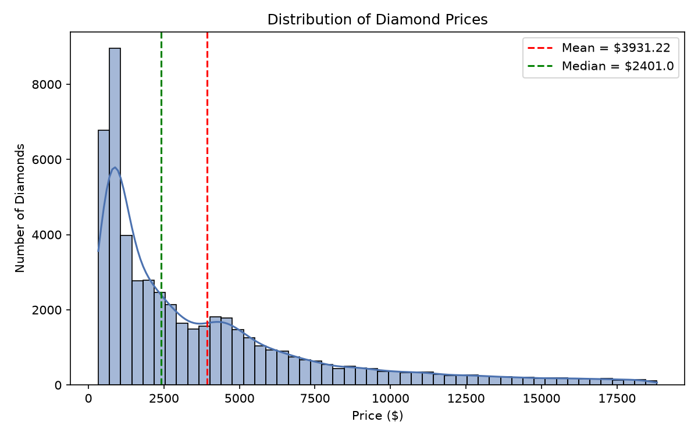
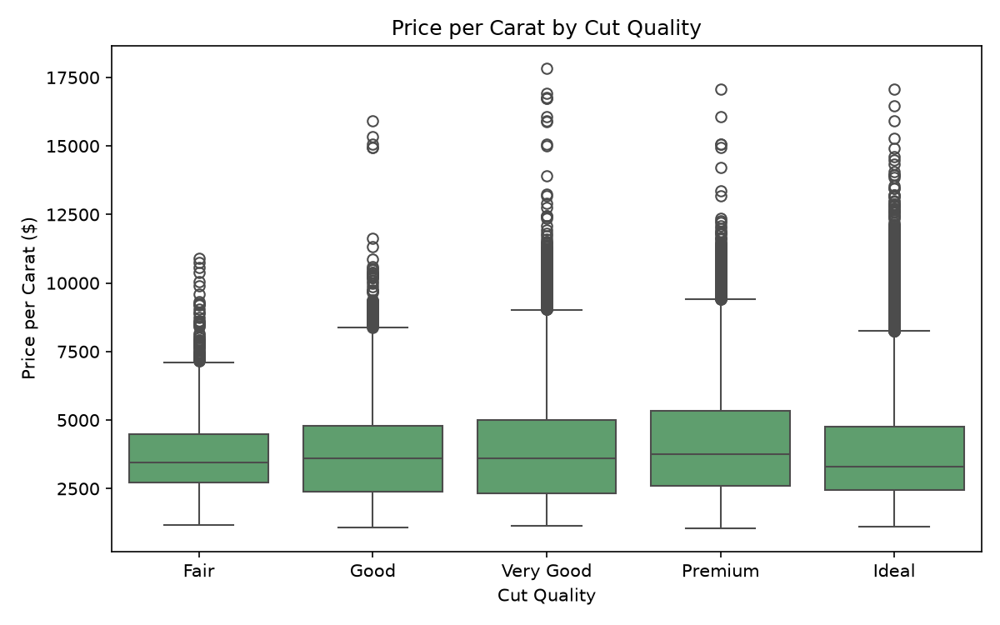
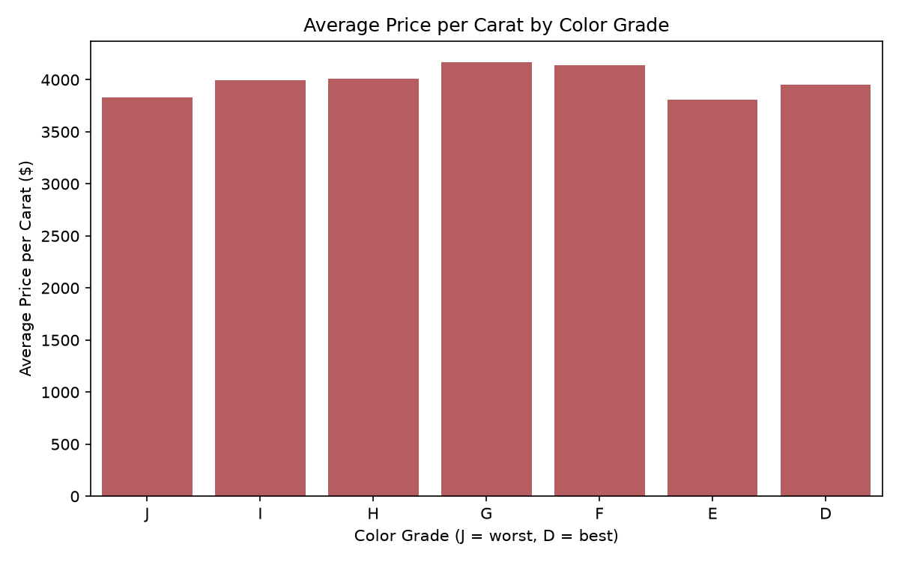
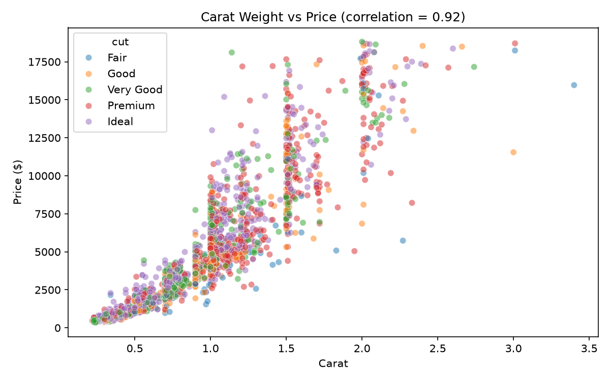

# Diamond Pricing Analysis

A data analyst portfolio project using Python (Pandas, Matplotlib, Seaborn) to analyze what drives diamond prices.

## Business Question

A jewelry retailer wants to understand what actually drives diamond prices, so it can price inventory competitively and flag stones that may be under- or over-priced relative to their characteristics. This project analyzes ~53,800 real diamond listings to answer:

1. What is the overall price distribution, and how skewed is it?
2. Which factor matters most for price: carat, cut, color, or clarity?
3. How does price per carat change across cut quality?
4. Are there pricing patterns across color grades that could signal under/over-priced inventory?
5. How strong is the relationship between carat weight and price?

## Data Source

A public dataset of ~54,000 diamonds with attributes (carat, cut, color, clarity, price, dimensions), commonly used for pricing and regression analysis. Loaded directly from a public CSV: [seaborn-data/diamonds.csv](https://raw.githubusercontent.com/mwaskom/seaborn-data/master/diamonds.csv)

## Tools Used

- **Python**
- **Pandas** — data loading, cleaning, and analysis
- **Matplotlib / Seaborn** — data visualization

## Key Findings

- Diamond prices are **right-skewed**: average price is $3,931 vs. a median of $2,401 — a smaller number of high-value stones pull the average up, so pricing strategy should reference the median for typical inventory.
- **Carat weight is by far the strongest driver of price** (correlation of 0.92) — any pricing model should weight carat far above cut, color, or clarity alone.
- **Premium cut** diamonds command the highest average price per carat ($4,222), suggesting cut-quality inventory can be priced at a premium.
- **Color grade G** commands the highest price per carat among color grades — stones with lower color grades but strong cut/clarity may represent underpriced opportunities.
- Price **accelerates** with carat size rather than scaling linearly — retailers should avoid flat per-carat multipliers for larger stones, which likely command a premium beyond simple linear scaling.

## Charts

| Price Distribution | Price per Carat by Cut |
|---|---|
|  |  |

| Price per Carat by Color | Carat vs Price |
|---|---|
|  |  |

## How to Run

```bash
pip install pandas matplotlib seaborn
python3 diamond_pricing_analysis.py
```

This prints the full analysis and summary to the terminal, and saves 4 chart images to a `charts/` folder.

## Project Structure

```
diamond-pricing-analysis/
├── diamond_pricing_analysis.py   # Main analysis script
├── charts/                       # Generated chart images
└── README.md
```